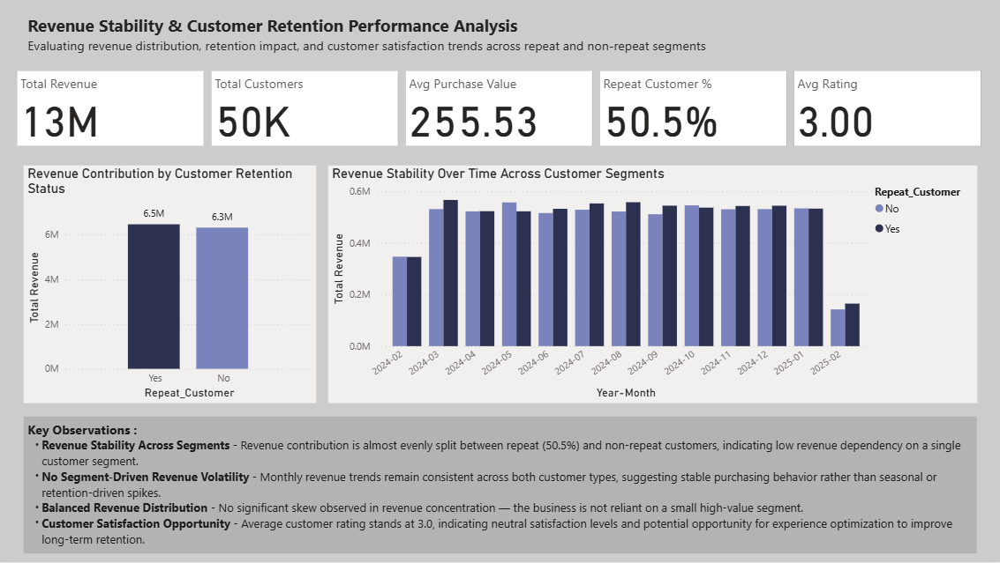

# Customer Revenue & Retention Analysis

## Overview
This project analyzes customer purchasing behavior to understand how **repeat vs non-repeat customers impact revenue stability and business performance**.

The goal is to move beyond basic metrics and evaluate:
- Revenue dependency on customer segments  
- Stability of revenue over time  
- Customer satisfaction patterns  

---

## Problem Statement
Businesses often assume repeat customers drive the majority of revenue.  
This analysis tests that assumption by examining:
- Revenue contribution split  
- Behavioral differences across segments  
- Consistency in monthly performance  

---

## Tools & Technologies
- **Excel** → Initial data understanding  
- **MySQL** → Data transformation & aggregation  
- **Power BI** → Data modeling, DAX measures & dashboard creation  

---

## Key Analysis Performed

### 1. Customer Segmentation
- Repeat vs Non-repeat customer classification  
- % distribution of total customers  

### 2. Revenue Contribution Analysis
- Revenue split across segments  
- Dependency on specific customer groups  

### 3. Time-Based Revenue Analysis
- Monthly revenue trends  
- Segment-wise stability comparison  

### 4. Customer Behavior Metrics
- Average Purchase Value  
- Transactions per Customer  
- Rating Participation Rate  
- Average Customer Rating  

---

## Key Insights

- Revenue contribution is **evenly distributed (~50/50)** between repeat and non-repeat customers  
- Monthly revenue trends show **consistent stability across both segments**  
- No strong dependency on a single customer group → **low revenue risk concentration**  
- Average rating of **3.0 indicates neutral satisfaction**, highlighting scope for experience improvement  

---

## Dashboard Preview

---

## Project Structure
